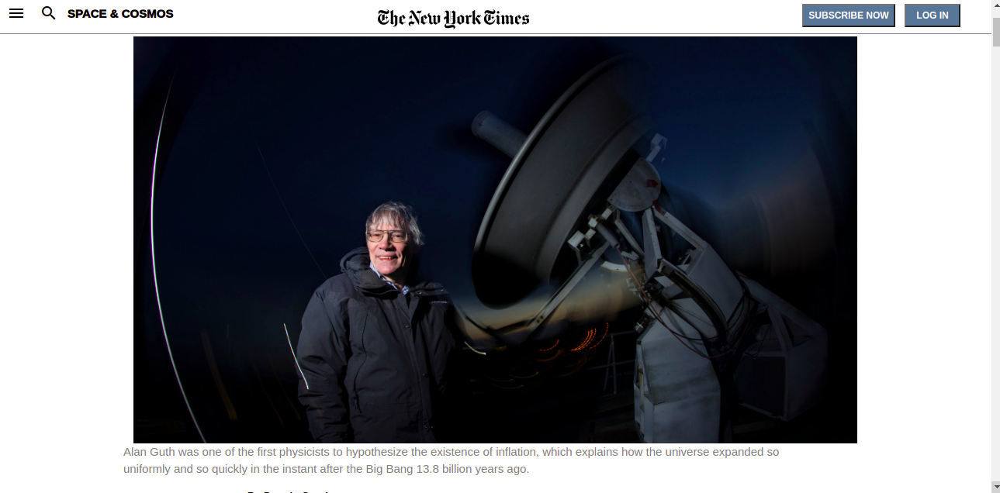
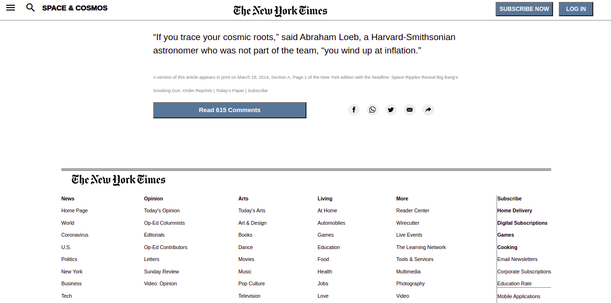

<h2>Replicating a New York Times article</h2>

 In this project, in order to flex my CSS muscles, I replicated <a href="https://www.nytimes.com/2014/03/18/science/space/detection-of-waves-in-space-buttresses-landmark-theory-of-big-bang.html?_r=0">this</a> article from the NYT.

 The idea is to make it look as much as possible. No JS is used. 

You can see the live preview <a href= "https://muratcan-yuksel.github.io/News-article> here </a>  

